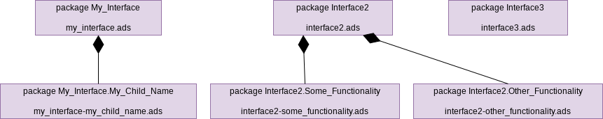

.. Copyright (C) 2024 - 2025 NVIDIA CORPORATION & AFFILIATES
.. Copyright (C) 2021 - 2024 AdaCore
..
.. Permission is granted to copy, distribute and/or modify this document
.. under the terms of the GNU Free Documentation License, Version 1.3 or
.. any later version published by the Free Software Foundation; with the
.. Invariant Sections being "Attribution", with no Front-Cover
.. Texts, and no Back-Cover Texts.  A copy of the license is included in
.. the section entitled "GNU Free Documentation License".

Unit Requirements in ADS Files
------------------------------

This section defines process steps for specifying a subset of software
unit requirements via software interfaces specified in ADS files.

This process does not require any given software interfaces to be
expressed in the form of ADS files, nor does this process require all
unit requirements to be allocated to software units via software
interface specifications. Each software unit typically must provide at
least one software interface, and may use zero or more software
interfaces provided by other units, but each of those software
interfaces can be expressed either in the form of ADS files in
accordance with this process, or by other means. And even where a
software interface is expressed in the form of ADS files, not all unit
requirements related to that software interface need to be specified
in those ADS files; some unit requirements may be allocated to the
software unit from other sources, such as a requirements management
tool.

This section constrains the specification of software unit
requirements as part of software interfaces in ADS files. Ultimately,
all software unit requirements, regardless of how they are specified,
will be satisfied by the software unit design and implementation.

.. _step-identify-external-packages:

Identify External Interface Packages
^^^^^^^^^^^^^^^^^^^^^^^^^^^^^^^^^^^^

For each software interface specification to be expressed in the form
of ADS files, design one or more package hierarchies that will specify
the software interface. In this step, only packages with software
interfaces are designed. Packages internal to specific units will be
created in the design phase.

The following diagram illustrates six packages organized in three
package hierarchies that could collectively form a software interface
specification. Some of the packages are children of other
packages. (This diagram also illustrates the naming convention for the
external ADS files created in the :ref:`step-create-external-ads` step.)

Each package hierarchy has a root named e.g. ``My_Interface``, and can
have 0 or more child packages named e.g. ``My_Interface.My_Child_Name``.

In doing this, determine which packages:

* Are to be implemented by the provider of the software interface and,
  if so, whether their package specifications will have private parts.
* Are to be implemented by the user of the software interface (this is
  not common) and, if so, whether their package specifications will be
  allowed to have private parts.
* Consist of public specification (possibly including data types and
  expression functions) only and are not implemented by any unit. This
  is the case for a package specification that (1) does not require a
  private part, (2) does not require a package body, and (3) does not
  defer any bodies to subunits.

In designing package hierarchies, do not make a package a child (or
indirect descendant) of another package if this would result in the
descendant package and the ancestor package both being implemented but
by separate software units, unless the ancestor package's
specification is not allowed to have a private part. This process
forbids this practice because a package can reach into the private
part of the specification of an ancestor package, and this process
treats the private part of a package specification as being strictly
part of software unit design and implementation (not software unit
requirements). During this step, it is only possible to check that
each software interface lacks this property, but in a later step, each
software unit will be checked for potential violations of this rule.

The choice of the number and organization of the packages in each of
the hierarchies is left to the engineer(s) specifying the software
interface.

Step ID: Identify_External_Packages

Nested packages allowed
"""""""""""""""""""""""

So as to facilitate the modular specification and implementation of
software interfaces without requiring a one-to-one correspondence
between packages and ADS/ADB source file pairs, each of the
aforementioned packages may also contain nested packages, and may also
leverage Ada subunits (via the Ada ``is separate`` syntax). However,
nested packages and subunits are not specified in this step because
they do not have dedicated ADS files.

Note on packages hierarchies implemented by multiple distinct software units
""""""""""""""""""""""""""""""""""""""""""""""""""""""""""""""""""""""""""""

This step still allows for some situations where the same package
hierarchy can include both packages implemented by the provider of the
software interface unit and packages implemented by the user of the
software interface. For example, the packages could share a common
ancestor package that consists of specification only: In the above
diagram, it could be the case that package ``Interface2`` merely defines
data types and is not implemented by any unit, while
``Interface2.Some_Functionality`` is implemented by one unit and
``Interface2.Other_Functionality`` is implemented by another unit.

Situations where a package is spread among multiple object files
""""""""""""""""""""""""""""""""""""""""""""""""""""""""""""""""

Typically, the Ada language and the GNAT tools collectively ensure
that a single package in the package hierarchy will not be partially
compiled into one object file and partially compiled into another
object file. However, there are some exceptions to this:

* If a package specification defines a tagged type with one or more
  dispatching operations, other package specifications and bodies can
  declare type extensions with dispatching operations that override
  the former dispatching operations.

* If a package specification defines an access-to-subprogram type,
  other package specifications and bodies can declare matching
  subprograms, accesses to which can then be written to values of that
  access-to-subprogram type.

* Subprogram bodies provided in a package specification, and inline
  subprogram bodies provided in a package body, are compiled into the
  caller's object file.

* Generic packages and subprograms can be instantiated by other
  compilation units and incorporated into other object files.

.. _step-create-external-ads:

Create External ADS
^^^^^^^^^^^^^^^^^^^

For each (non-nested) package in each of the package hierarchies
designed in the :ref:`step-identify-external-packages` step, per the GNAT default
file naming convention, create an ADS file with name
${PACKAGE_FILE_NAME}.ads, where PACKAGE_FILE_NAME is a file name
derived from the package name using the following conversion
convention: the name is formed by taking the full expanded name of the
package and replacing the separating dots with hyphens and using
lowercase for all letters.

For example, the full name of the child package ``My_Child_Name`` of the
package ``My_Interface`` would be ``My_Interface.My_Child_Name``. The
specification filename would be ``my_interface-my_child_name.ads``.

Note: This is consistent with the default naming convention supported
by the GNAT tools. The GNAT tools enable this convention to be
overridden, but for clarity, this process does not permit the default
naming convention to be overridden. In particular, the
:ref:`step-create-project-file` step forbids the project file from including a
``Naming`` package.

Step ID: Create_External_ADS

.. _step-declare-spark-package:

Declare SPARK Package
^^^^^^^^^^^^^^^^^^^^^

For each external ADS file created in the :ref:`step-create-external-ads` step,
declare the single corresponding library level package whose name was
chosen in the :ref:`step-identify-external-packages` step.

These packages should be declared with ``SPARK_Mode => On``, e.g.:

.. code-block:: ada

   package My_Interface
   with SPARK_Mode => On
   is

   --  ...

   end My_Interface;

Or:

.. code-block:: ada

   package My_Interface.My_Package
   with SPARK_Mode => On
   is

   ...

   end My_Interface.My_Package;

Note: The packages above must be declared public (without the private
keyword), because they are intended to be used from other packages in
unrelated parts of the hierarchy.

Note: The compiler will verify that the correct package is specified
in each ADS file, per the GNAT naming convention enforced by this
process.

Note: This process permits packages to be declared with `SPARK_Mode =>
Off` (or with no SPARK_Mode aspect at all). However, doing so will
increase the cost of verification in later steps.

Step ID: Declare_SPARK_Package

.. _step-identify-dependencies:

Identify Dependencies
^^^^^^^^^^^^^^^^^^^^^

For each external ADS file created in the :ref:`step-create-external-ads` step,
identify other external ADS files on which this ADS file depends
(e.g., for data type definitions or C/C++ bindings), and add them to
the list of with clauses (optionally adding use clauses as well,
subject to any restrictions on use clauses in the Ada/SPARK
Guidelines) at the beginning of the ADS file.

Only dependencies needed by the package specification should be added
during this step. (This process mandates the enabling of the compiler
warnings controlled by ``-gnatwu``, which will detect unnecessary with
clauses.) Dependencies needed only by the corresponding package body
should directly be added in the ADB file in a later step.

Step ID: Identify_Dependencies

.. _step-declare-types-states-and-subprograms:

Declare Types, States, and Subprograms
^^^^^^^^^^^^^^^^^^^^^^^^^^^^^^^^^^^^^^

For each external ADS file created in the :ref:`step-create-external-ads` step,
declare each type and subtype that is expected to be needed by the
subprogram declarations to be declared in this package and is not
already declared in imported packages. In the unit requirement phase,
only software interfaces are declared, hence only those types and
subtypes used by the software interfaces shall be added here.

For each external ADS file created in the :ref:`step-create-external-ads` step,
declare global constants and global variables that are part of the
software interface in the public part of the package specification,
and use the Abstract_State aspect to declare any abstract states that
will be necessary in the :ref:`step-capture-requirements` step in order to specify
Global aspects for subprograms that are part of the software
interface. Note: A subprogram body whose subprogram declaration has a
Global aspect may only access a private global variable if that
private global variable is part of the refinement of an abstract state
and that abstract state is included in the Global aspect.

For each external ADS file created in the :ref:`step-create-external-ads` step,
for each desired entry point into the associated library-level
package, declare a function or procedure, or define an expression
function, in the public part of the appropriate package specification.

Note: The choice of formal parameter types and subtypes may be
influenced by the :ref:`step-capture-requirements` step below. Types and subtypes
can have type contracts (such as ranges, null exclusions, and type
predicates) that effectively act as requirements.

Note: When a function can be expressed as a single, public expression,
it can require less development effort to declare the function as an
expression function, instead of having a separate body and then a
postcondition that effectively duplicates the body. For example,
expression functions can be used in the internal contracts, which can
help to automate proofs. However, other contracts (such as
preconditions) can still be necessary for expression functions.

Step ID: Declare_Types_States_And_Subprograms

.. _step-capture-requirements:

Capture Requirements
^^^^^^^^^^^^^^^^^^^^

For each software requirement related to the software interface, add
the software requirement to one of the external ADS files created in
the :ref:`step-create-external-ads` step.

Include all such requirements, even if they might be difficult to
formalize, such as the following categories:

* Memory usage constraints;
* Timing constraints;
* Requirements derived from refined hardware software interfaces
  (HSIs);
* Safety measures resulting from safety-oriented analyses;

Include requirements that are to be allocated to any software unit
that provides the software interface, and include requirements that
are to be allocated to any software unit that uses the software
interface.

Note:

* In the simple case, if a software unit supplies the ADB file
  corresponding to an external ADS file, and that external ADS file
  declares a subprogram, then the subprogram body is part of the
  unit. In this case, subprogram contracts and other requirements
  restricting the callee are requirements imposed on the unit, whereas
  subprogram contracts and other requirements restricting the caller
  are requirements imposed on other units. (There may also be calls to
  the subprogram from within the callee's unit, in which case
  requirements restricting the caller are also unit design constraints
  for the callee's unit).
* However, access-to-subprogram types and tagged types with primitive
  operations are notable exceptions to this rule. If the public part
  of an external ADS file declares an access-to-subprogram type, then
  other units (units other than the unit that supplies the ADB file
  corresponding to the external ADS file) may assign subprograms to
  values of that type. And if the public part of an external ADS file
  declares a tagged type with primitive operations, then other units
  (again, units other than the unit that provides the ADB file
  corresponding to the external ADS file) may derive new types from
  that tagged type and provide their own implementations of the
  primitive operations. In these cases, subprogram contracts
  restricting the caller and callee are effectively requirements
  imposed on all the aforementioned units.

Capture Formal Requirements
"""""""""""""""""""""""""""

Formally specify software requirements using appropriate type,
subprogram, and package SPARK annotations, such as:

* Selection of subprogram formal parameter types that indirectly
  restrict the set of possible parameter values, e.g., through ranges,
  null exclusions, type predicates, or type invariants.

  * Note: This applies to in, in out, and out parameters. For in and
    in out parameters, the selection of a formal parameter type
    represents a requirement on the caller. For in out and out
    parameters, the selection of a formal parameter type represents a
    requirement on the callee.

* Preconditions, e.g., through the ``Pre`` or ``Pre'Class`` aspects.

  * Note: A precondition represents a requirement on the caller.

* Postconditions, e.g., through the ``Post``, ``Post'Class``,
  ``Refined_Post``, ``Contract_Cases``, or ``Exceptional_Cases`` aspects.

  * Note: A postcondition represents a requirement on the callee.

* Restrictions on callee accesses to global state, e.g., through the
  Global aspect. The Global aspect must be specified for all
  procedures (whether SPARK or not; enforced by GNATcheck rule
  SPARK_Procedures_Without_Globals) and for all non-SPARK Ada functions (not
  automatically enforced). This is necessary for verifying the absence
  of unintended functionality because it ensures reviewers see the
  specific global variables being accessed by the unit-internal
  subprograms. This aspect does not need to be specified for SPARK
  functions, unless a specific requirement maps to it, because SPARK
  functions have no side effects. If omitted and GNATprove has
  visibility into the body of the function, GNATprove will generate a
  correct overapproximation of the contract for its analysis. If
  omitted and GNATprove does not have visibility into the body of the
  function, GNATprove will issue a warning if the function is
  called. These contracts list all the global variables:

  * written (mode Output),
  * read (mode Input),
  * both read and written, or partially written (mode ``In_Out``), and
  * used only in contracts and assertion pragmas (mode ``Proof_In``)

* Restrictions on callee data flow, e.g., through the ``Depends`` aspect

  * Note: Most software requirements cannot be expressed through
    Depends aspects. Notable exceptions include security requirements
    related to information disclosure.

* A forward progress user aspect (with ``User_Aspect =>
  (Forward_Progress)``), callee return constraint (with
  ``Always_Terminates``), or callee no-return constraint (with
  ``No_Return``)

  * Note: If a subprogram is recursive and annotated as having forward
    progress or always-returning, then a ``Subprogram_Variant`` must also
    be provided.
  * Note: Absent the ``No_Heap_Allocations`` and ``No_Secondary_Stack``
    local restrictions (which are for convenience wrapped into the
    Forward_Progress user aspect), a subprogram might terminate the
    partition with a storage error instead of returning, even if an
    ``Always_Terminates`` aspect is specified.
  * Note: The meaning of a ``Forward_Progress`` user aspect on a package
    or subprogram can be limited by an ``Exceptional_Cases`` contract on
    a subprogram. Combining an ``Exceptional_Cases`` aspect with
    ``Forward_Progress`` allows contracts to define circumstances under
    which the subprogram might raise an exception instead of
    returning.

* Aspects for interfacing with C/C++ code (``Import => True`` or ``Export
  => True`` combined with ``Convention => C`` and ``External_Name =>
  symbol_name``).

Attempt to decompose HSI requirements (intended hardware behavior and
assumptions made by the hardware) so that SPARK contracts can specify
some or all of the HSI. This can typically be done by creating a SPARK
model of the hardware:

* Wrap access to hardware functionality into appropriate procedures,
  typically in dedicated software units that abstract the hardware.

  * Note: To the extent these procedures are also implemented in SPARK
    (as opposed to being merely specified in SPARK), it will typically
    be necessary to use pragma Assume in order for GNATprove to accept
    that the postconditions are met, because GNATprove has only
    limited ability to reason about the values of volatile data such
    as hardware state. See the :ref:`step-implement-spark-package` step for more
    information about the use of pragma Assume in this process.

* Use Ada language features to precisely specify data types
  corresponding to the data exchanged between hardware and software as
  described in the HSI.
* Use preconditions to state assumptions made by the hardware about
  software.
* Use postconditions and type invariants to specify intended hardware
  behavior.
* Introduce Ghost subprograms as needed to support the specification
  of the preconditions and postconditions.

To reduce the possibility of unintended functionality, all the
potential effects apart from output parameters and return values must
be explicitly covered through Global aspects (except for SPARK
functions because they are formally defined to have no side effects),
so we know exactly which variables and abstract states are read and
written; contracts must express fully the requirements over changes to
data (see [TFV13]_ for additional details).

Ensure that all required preconditions are captured using the
precondition aspects or through type contracts on input data, and
ensure that all required effects (side effects, return values, etc.)
are captured using the postcondition aspects or type contracts on
output data. These contracts may be used on expression functions that
will be effectively defined in the design phase.

Ensure that the comments at each type declaration and subprogram
declaration collectively explain, in English, the meaning of each of
the SPARK annotations. Note: These comments aim to aid in
comprehensibility, but are not the authoritative specification of the
formal requirements. The SPARK contracts themselves are the
authoritative specification of the formal requirements.

This specification work may involve additional functions, types or
global variables. Ensure that all of these are marked Ghost.

Note: Ghost code is defined in [SUG]_, section `Ghost code
<https://docs.adacore.com/R/docs/gnat-25.1/spark2014/html/spark2014_ug/en/source/specification_features.html#ghost-code>`_,
and in [SRM]_, section `Ghost entities
<https://docs.adacore.com/R/docs/gnat-25.1/spark2014/html/spark2014_rm/subprograms.html#ghost-entities>`_. Ghost
code does not affect the functionality of the program and is not part
of the final object code of software developed according to this
process (because this process prohibits the use of the ``-gnata``
compiler switch or the use of the ``pragma Assertion_Policy`` with the
``Check`` parameter when building production binaries).

Note: The verification done in step :ref:`step-implement-spark-package` will
ensure that each subprogram implemented in SPARK complies with the
associated contracts.

Note: It is beneficial to capture requirements formally even if it is
known that the requirements will be non-formally-verified, because it
is less expensive to develop test cases for formal unit specification
fragments than for non-formal unit specification fragments (see the
:ref:`step-write-tests` step).

Capture Non-Formal Requirements
"""""""""""""""""""""""""""""""

Each requirement that is not fully expressed in a SPARK annotation
must be specified non-formally via natural language and/or semi-formal
notation, and later verified through the usual non-formal activities
(inspection, testing, etc.) as described in subsequent steps. Note:
This process does not permit a requirement to be partially expressed
in a SPARK annotation and partially expressed non-formally. Such a
requirement should be split into a formal requirement and a non-formal
requirement so as to maximize the use of SPARK.

For each software requirement that was not captured as a formal
requirement, document the requirement using a comment. (A requirement
ID will be assigned to each such non-formal requirement in the
subsequent :ref:`step-assign-requirement-unique-ids` step.)

For each non-formal requirement identified as being either ASIL C or
ASIL D, the normative part of the requirement must be specified in
semi-formal notation, such as with natural language in EARS
syntax. (It is recommended to use semi-formal notation for all
non-formal requirements.)

Non-formal requirements must be implementation free.

Each non-formal safety requirement must be atomic (i.e., it must not
be possible to split it into two or more independent requirements),
with one exception: If making a non-formal requirement atomic would
interfere with the achievement of other objectives identified in this
step for the specification of requirements, like comprehensibility,
then the non-formal requirement need not be fully atomic. In this
latter case, the non-formal requirement should instead be made only as
atomic as possible without compromising the other objectives.

Step ID: Capture_Requirements

Public Expression Functions
"""""""""""""""""""""""""""

A public expression function specifies its return value precisely in
the form of an expression that is part of the public part
of the ADS file, lessening the need for requirements. Typically, the
only requirements that are captured for public expression functions
are formal/informal preconditions. All other requirements are
inherently redundant with the expression that specifies the
return value. However, it may be useful to specify non-precondition
requirements of certain public expression functions to clarify their
properties, so this process does not forbid non-precondition
requirements on public expression functions.

For a public expression function that is not intended to be called
directly by the user but rather is intended to be used only to specify
requirements, the public expression function's contracts are not
themselves requirements. In particular, it is not necessary to use
natural language to explain each precondition of a public expression
function that is only used to specify requirements.

.. _step-assign-requirement-unique-ids:

Assign Requirement Unique IDs
^^^^^^^^^^^^^^^^^^^^^^^^^^^^^

For each software interface specified with external ADS files, use
structured comments with the syntax defined in the Traceability Model
section to assign a unique ID to each atomic requirement in the public
parts of the software interface's external ADS files.

* Each non-formal type contract and each formal type contract is given
  a unique ID. In SPARK, formal type contracts that can be used in
  public parts of package specifications include Ada scalar
  constraints (``range``, ``digits``, and ``delta``), Ada composite
  constraints (index constraints and discriminant constraints), Ada
  null exclusions (``not null``), type predicates (specified through
  ``Predicate``, ``Static_Predicate``, and ``Dynamic_Predicate`` aspects),
  and default initial conditions (``Default_Initial_Condition``
  aspects). (Type invariants, specified through ``Invariant`` and
  ``Type_Invariant`` aspects, are not permitted in public parts of
  package specifications.)

  .. code-block:: ada
     :caption: Example

     -- @type_contract_informal (My_Index_Not_5)
     -- A value of type My_Index_Type shall not be 5.
     -- @type_contract (In_Range)
     type My_Index_Type is range 1 .. 10;

     subtype My_Formal_Not_5_Index_Type is My_Index_Type
     with
        -- @type_contract (Not_5)
        Predicate => (My_Formal_Not_5_Index_Type /= 5);

* A subprogram ``Pre``, ``Pre'Class``, ``Post``, ``Post'Class``, or
  ``Refined_Post`` contract or case of a ``Contract_Cases`` contract is
  often expressed as a conjunction of atomic requirements. Each atomic
  requirement is given a unique ID.

  .. code-block:: ada
     :caption: Example

     with Pre =>
        -- @pre (Ready) Must only be called while in the
        -- Ready state, and specifically in the Fully_Ready
        -- sub-state.
        (Ready and then Fully_Ready) and then
        -- The following is not actually a requirement (and is
        -- not considered part of the Ready structured comment)
        -- because debugging is disabled in the product.
        (not Debug) and then
        -- @pre (Inputs_Acceptable) If the inputs are not
        -- valid, then it must be possible to report errors.
        (Inputs_Valid or else Errors_Allowed),

* A subprogram ``Global`` contract is given a single unique ID because
  it is expressed as a disjunction of allowed global variable
  accesses.

  .. code-block:: ada
     :caption: Example

     -- @outcome (Global) Reads State and writes Data.
     Global => (Input => State, Output => Data),

* A subprogram ``Depends`` contract can be given a single unique ID, or
  each dependency_clause of a ``Depends`` contract is given a single
  unique ID because it is expressed as a disjunction of allowed data
  flows.

  .. code-block:: ada
     :caption: Example

     -- @outcome (Depends) The final value of X depends
     -- only on the initial value of Y, and vice versa.
     Depends => (X => Y, Y => X),

* Each subprogram or package Forward_Progress user aspect,
  Always_Terminates aspect, or No_Return aspect callee return
  constraint is given a single unique ID.

  .. code-block:: ada
     :caption: Example

     -- @outcome (Forward_Progress) This procedure must
     -- eventually return.
     User_Aspect => Forward_Progress;

* Each subprogram or package non-formal requirement is given a single
  unique ID.

  .. code-block:: ada
     :caption: Example

     -- @outcome (Overhead) This procedure must complete
     -- within 10ms.
     -- @end

* Where a subprogram has requirements and the subprogram's name is
  overloaded (i.e., there are other subprograms in the same scope with
  the same name), assign a local ID to the subprogram so that each of
  the subprogram's requirements can have a unique ID.

  .. code-block:: ada
     :caption: Example

     -- @func Get_Value
     function Get (My_Object : Object) return Value
     with
        -- @pre (Init) My_Object shall already be initialized.
        Pre => Is_Initialized (My_Object);

     -- @func Get_Status
     function Get (My_Object : Object) return Status
     with
        -- @pre (Init) My_Object shall already be initialized.
        Pre => Is_Initialized (My_Object);

     -- @proc Set_Value
     procedure Set (My_Object : Object; New_Value : Value)
     with
        -- @pre (Init) My_Object shall already be initialized.
        Pre => Is_Initialized (My_Object),
        ...

     -- @proc Set_Status
     procedure Set (My_Object : Object; New_Status : Status)
     with
        -- @pre (Init) My_Object shall already be initialized.
        Pre => Is_Initialized (My_Object),
        ...

For each requirement that is assigned a unique ID, create a trace link
(in the manner specified in the Ada/SPARK Process Binding) from the
requirement to the non-unit-level work product fragments (if any) that
directly motivate the requirement.

Note: Typically some of the requirements are motivated only by
software unit design decisions in other software units. For such
requirements, no trace links are created to the requirement in this
process step.

Step ID: Assign_Requirement_Unique_IDs

Language bindings not considered requirements
"""""""""""""""""""""""""""""""""""""""""""""

For each C/C++ software interface specification that is converted to
Ada/SPARK as part of specifying requirements in ADS files, the
``Convention => C`` and ``Import`` / ``Export`` aspects are considered
formal interface details, but not requirements. It is not necessary to
assign a requirement ID to these aspects.

Rationale for not making exceptions for formal requirements
"""""""""""""""""""""""""""""""""""""""""""""""""""""""""""

The purpose of assigning unique IDs to requirements (as is required
for safety requirements by :ref:`ISO 26262-8:2018, 6.4.2.5a
<iso-trace-p8-c6-4-2-5-a>`) is to support traceability. It is in
theory not necessary to assign a unique ID to a requirement if the
requirement is always formally-verified and the requirement is only
ever needed for formal verification, because then the purposes of
traceability defined in :ref:`ISO 26262-8:2018, 6.4.3.2
<iso-trace-p8-c6-4-3-2-a>` are adequately achieved through formal
verification alone. However, it is very difficult to show definitively
that a requirement is only ever needed for formal verification. In
particular, all of the following conditions are necessary for a
requirement not to need a unique ID, and this process holds that it is
too expensive to verify all these conditions individually:

* The requirement is a formal requirement.
* The requirement does not trace to any non-unit-level work products.
* If the formal requirement is a type contract, then both of the
  following conditions hold:

  * Only SPARK Platinum code reads objects of that type. (This ensures
    that the type contract is not utilized as part of any non-formal
    verification.)
  * Only SPARK code writes objects of that type. (This ensures that
    SPARK will formally verify that only values complying with the
    type contracts are written to objects of that type.)

* If the formal requirement is a subprogram contract, then both of the
  following conditions hold:

  * Only SPARK Platinum code depends on the subprogram contract. (This
    ensures that the subprogram contract is not utilized as part of
    any non-formal verification.) In particular:

    * If the subprogram contract is a precondition (e.g., a ``Pre`` or
      ``Pre'Class`` aspect), then only SPARK Platinum code embodies the
      declaration containing the subprogram contract. For purposes of
      this process step, to embody a declaration containing a
      subprogram contract means specifically to do any of the
      following:

      * To define a subprogram body that completes the original
        declaration (if the original declaration declares a
        subprogram).
      * To declare a primitive operation of a type extension such that
        the primitive operation overrides the original declaration (if
        the original declaration declares a primitive operation of a
        tagged type).
      * To assign a value to an object of the type declared by the
        original declaration (if the original declaration declares an
        access-to-subprogram type).

    * If the subprogram contract is not a precondition, then only
      SPARK Platinum code applies the declaration containing the
      subprogram contract. For purposes of this process step, to apply
      a declaration containing a subprogram contract means
      specifically to do any of the following:

      * To directly call the declared subprogram (if the declaration
        declares a subprogram).
      * To perform a dispatching call to the declared subprogram or an
        overriding subprogram (if the declaration declares a primitive
        operation of a tagged type).
      * To call through an object of the declared type (if the
        declaration declares an access-to-subprogram type).

  * Only SPARK code is responsible for complying with the subprogram
    contract. (This ensures that SPARK formally verifies compliance.)
    In particular:

    * If the subprogram contract is a precondition, then only SPARK
      code applies the declaration containing the subprogram contract.
    * If the subprogram contract is not a precondition, then only
      SPARK code refines the declaration containing the subprogram
      contract.

* If the formal requirement is a package contract, then the above
  conditions for individual subprograms apply to all the subprograms
  declared within the scope of that package contract.

Requirement status
""""""""""""""""""

ISO 26262 also requires that each safety requirement have a status
(:ref:`ISO 26262-8:2018, 6.4.2.5b <iso-trace-p8-c6-4-2-5-b>`). This
process assigns a status to each requirement, whether a formal
requirement or a non-formal requirement, and whether safety or
non-safety, based on change management:

* A requirement is in the proposed state if a change request has been
  submitted and the change request would add the requirement (or
  substitute the requirement for an existing approved requirement),
  but the change request has not yet been inspected and approved by an
  appropriate developer (a developer who is involved in the
  development of the containing work product but is not the author of
  the change request).
* A requirement transitions from the proposed state to the reviewed
  state when an appropriate developer inspects the associated change
  request, identifies no issues with the change request, and approves
  the change request.
* A requirement transitions from the reviewed state to the approved
  state when the project manager or safety manager for each work
  product affected by the change request approves the change request.
* A requirement transitions from the approved state to the confirmed
  state when the change request is completed.
* A requirement transitions from the confirmed state to the canceled
  state upon the completion of an appropriately-approved change
  request that removes the requirement.

.. _step-verify-formal-requirement-consistency:

Verify Formal Requirement Consistency
^^^^^^^^^^^^^^^^^^^^^^^^^^^^^^^^^^^^^

In this step, the consistency of the formally-specified fragments of
the software interface with one another is verified.

Launch the compiler on the specification. Fix any errors or warnings
in the external ADS files. (For this process step, disregard any
errors or warnings related to the absence of corresponding ADB
files. If work has already begun on future process steps, also
disregard any errors or warnings pertaining to files added in later
process steps.)

To launch just the compiler, run the command:

.. code-block:: bash

   gprbuild -c -P my_interface_project

where my_interface_project is the name of a project file that complies
with the requirements stated in the :ref:`step-create-project-file` step and which
includes the external ADS files of the software interface.

Launch the verification tool in order to check consistency between the
declared types, data, and subprograms and the contracts.

To run the verification tool, you can simply run the command:

.. code-block:: bash

   gnatprove -P my_interface_project -U

During this step, most of the contracts are unprovable (except for
example contracts specified for expression functions defined in the
ADS file), however the tool verifies the consistency of the contracts
with the declared data.

Optional Pass Criteria: GNATprove reports no warnings and no errors,
except for warnings and errors disregarded for this process step as
described above.

Note about the pass criteria: As indicated in the Software Unit
Verification Checklist, the verification of this step is redundant
with the verification of the :ref:`step-compile-project` and :ref:`step-verify-project`
steps. If an external ADS file is used by at least one software unit
that follows this process, and if there are any inconsistencies within
the formally-specified fragments of that external ADS file, then
errors and/or warnings will occur during execution of the
:ref:`step-compile-project` and/or :ref:`step-verify-project` steps on each of those software
units. Therefore the pass criteria for this step are optional. This
implies for example that if GNATprove reports a large number of
warnings and/or errors concerning a partial implementation of the
software interface, it is not necessary to conduct a thorough review
of the output in search of warnings and/or errors related to the
external ADS files.

Step ID: Verify_Formal_Requirement_Consistency

.. _step-verify-non-formal-requirement-consistency:

Verify Non-Formal Requirement Consistency
^^^^^^^^^^^^^^^^^^^^^^^^^^^^^^^^^^^^^^^^^

For each software interface, manually verify with a local peer review
that each of the non-formal requirements in the public parts of the
external ADS files is unambiguous, free from internal contradictions
and consistent with all the other requirements (formal and non-formal)
in the public parts of the external ADS files of the software
interface: There must be no contradictions among the requirements, but
this step does not require verification of the absence of
contradictions of the formal requirements with one another because
that is automatically verified in
:ref:`step-verify-formal-requirement-consistency`.

Note: This step requires an evaluation of the internal consistency of
the requirements within each software interface. This step does not
require an evaluation of the consistency between distinct software
interfaces, or between software interfaces and other sources of
software requirements. That latter evaluation of consistency is
performed in later phases.

There must be no duplication of information within the set of
non-formal requirements and between the non-formal and formal
requirements.

The non-formal requirements must be atomic, to the extent that this
does not impede any of the other required characteristics of
requirements defined in this step or the
:ref:`step-verify-requirement-correctness-and-completeness` step.

The non-formal requirements must be implementation free (see the
Terminology section).

Pass Criteria: All non-formal requirements are reviewed as part of a
local peer review and no inconsistencies reported by the reviewer(s).

Step ID: Verify_Non_Formal_Requirement_Consistency

.. _step-verify-requirement-correctness-and-completeness:

Verify Requirement Correctness, Completeness and Adherence to Ada/SPARK Guidelines
^^^^^^^^^^^^^^^^^^^^^^^^^^^^^^^^^^^^^^^^^^^^^^^^^^^^^^^^^^^^^^^^^^^^^^^^^^^^^^^^^^

For each software interface, using the traceability established in the
:ref:`step-assign-requirement-unique-ids` step, manually verify with a local peer
review that the public parts of the external ADS files are correct and
complete with respect to the work products from which the software
interface specification was derived (requirements, element
architecture, higher-level interface specifications, etc.).

Also manually verify (with an independent reviewer) that:

* the external ADS files are out-of-context-comprehensible to the
  independent reviewer, and
* the external ADS files observe the Ada/SPARK Guidelines (except for
  guidelines automatically enforced via GNATcheck rules).

Pass Criteria: Local peer review confirmed that all requirements are
fully described in the package specification and that these
requirements are correctly represented, out-of-context-comprehensible,
and compliant with guidelines.

Step ID: Verify_Requirement_Correctness_And_Completeness

.. _step-verify-requirement-necessity:

Verify Requirement Necessity
^^^^^^^^^^^^^^^^^^^^^^^^^^^^

For each software interface, manually verify with a local peer review
that all the captured requirements are necessary, i.e. they are
essential for correctness and completeness of the requirements
specification, considering both:

* the work products from which the software interface specification
  was derived, and
* the work products that depend on the software interface
  specification (element architecture, unit design, etc.).

Pass Criteria: Local peer review confirmed that all requirements are
necessary.

Step ID: Verify_Requirement_Necessity
